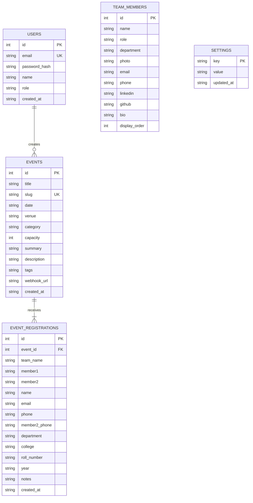

# 🏗️ Architecture & System Design Document
## AI Frontier Club Management Portal

---

## 1. System Overview & Topology

```mermaid
graph TD
    Client["🌐 Client (React + Vite + TailwindCSS)"]
    Server["⚡ Express.js Server (Node.js)"]
    
    subgraph Core Layer
        SQLite[("💾 Primary DB (SQLite / better-sqlite3)")]
        Auth["🔐 JWT / bcrypt Authentication"]
    end

    subgraph Integration & Cloud Layer
        Gmail["📧 Gmail SMTP (Nodemailer)"]
        GSheets["📊 Google Sheets Webhook (Apps Script)"]
        Firestore["🔥 Cloud Firestore (Firebase Admin)"]
    end

    Client -->|HTTP / JSON REST API| Server
    Server --> Auth
    Server -->|Read / Write (WAL mode)| SQLite
    Server -->|Async Confirmation Pass| Gmail
    Server -->|Real-time Row Sync| GSheets
    Server -->|Cloud Document Mirroring| Firestore
```

---

## 2. Technology Stack & Component Breakdown

### Frontend Layer
- **Framework**: React 18 with TypeScript.
- **Bundler & Tooling**: Vite 8 with Rolldown optimizations and chunk splitting.
- **Styling**: Tailwind CSS with custom neon cyber dark-theme tokens, glassmorphism filters, and CSS keyframe animations.
- **Icons & Motion**: Lucide React (`lucide-react`) and Framer Motion (`framer-motion`).
- **Routing**: React Router DOM (`react-router-dom` v6).

### Backend Layer
- **Runtime**: Node.js (ES Modules).
- **Framework**: Express.js with custom async handlers and error middleware.
- **File Uploads**: Multer handling multipart/form-data for coordinator photos and event banners.
- **Security**: `cors`, `helmet`, `express-rate-limit`, `jsonwebtoken`, `bcryptjs`.

### Data & External Integration Layer
- **Primary Embedded Store**: SQLite via `better-sqlite3` (zero-latency, ACID compliant, embedded in `server/data/club.db`).
- **Spreadsheet Engine**: `xlsx` (SheetJS) generating Microsoft Excel workbooks natively in memory.
- **Notification Engine**: Nodemailer connected to Gmail via Google App Passwords.
- **Cloud Database (Optional Mirror)**: Google Firebase Cloud Firestore via `firebase-admin`.
- **Live Spreadsheet Sync**: Google Apps Script Webhook API.

---

## 3. Database Schema Design (SQLite)



---

## 4. End-to-End Registration & Notification Dataflow

1. **Submission**: User fills 2-member team form on the frontend modal (`RegistrationModal.tsx`).
2. **Validation**: Server verifies required fields (Lead Name, valid Lead Email, Department, Year).
3. **Duplicate Check**: Query `event_registrations` for matching `(event_id, email)`. Rejects duplicate attempts.
4. **Primary Insertion**: Writes record to local SQLite database with generated registration ID (`AIF-{eventId}-{regId}`).
5. **Secondary Cloud Sync**:
   - Asynchronously mirrors record into Firebase Cloud Firestore collection `event_registrations`.
   - Dispatches POST payload to connected Google Apps Script Webhook (updates Google Sheet tab).
6. **Email Dispatch**: Generates branded plain text + HTML confirmation pass with attendee instructions and fires Gmail SMTP via Nodemailer.
7. **Client Feedback**: Returns HTTP 201 with ticket payload and direct "Open Confirmation in Gmail" deep link.

---

## 5. Security & Authentication Architecture

- **Token Lifecycle**:
  - Signed via `jsonwebtoken` with HMAC SHA-256 (`JWT_SECRET`).
  - Read from `Authorization: Bearer <token>`, `req.cookies.token`, or `req.query.token` (for Excel browser download popups).
- **Password Security**: Passwords hashed using `bcryptjs` with salt rounds = 10.
- **SQL Injection Prevention**: All queries utilize prepared statements (`db.prepare(...).run/get/all`) parameterized with bound variables.
