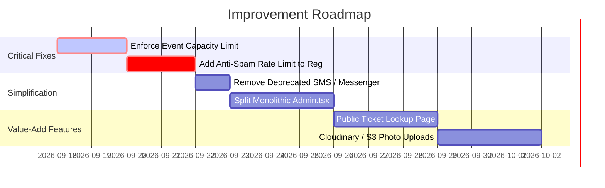

# ⚡ Essentials & Codebase Audit Report
## AI Frontier Club Management Portal

---

## 🔍 Part 1: Comprehensive Codebase Audit

### 🚨 1. What Breaks (Failure Modes & Risks)

| Component | Risk / Failure Mode | Root Cause | Fix / Solution |
|---|---|---|---|
| **Google Sheets Sync** | Registration hangs or fails to sync to spreadsheet | Webhook URL returns 404/Page Not Found if Apps Script is undeployed or not shared with *"Anyone"* access. | Always rely on internal SQLite / Direct Excel Export (`.xlsx`), with non-blocking try-catch for external webhooks. |
| **Cloud Deployments & Uploads** | Uploaded coordinator photos & banners disappear on restart | Photos are stored locally in `/uploads` on the disk via Multer. Ephemeral file systems (Render, Heroku, Vercel) wipe local files on new deployment. | Switch image storage to Cloudinary, AWS S3, or Firebase Storage for production. |
| **CORS in Production** | Frontend blocked from calling backend on live domains | `server.js` hardcodes `origin: process.env.CLIENT_URL \|\| "http://localhost:5173"`. If deployed on a custom domain without setting `CLIENT_URL`, all API requests fail. | Configure CORS to accept wildcard subdomains or an array of production origins. |
| **Fallback JWT Secret** | Authentication tokens can be forged if `.env` missing | Default fallback secret is `"dev-only-insecure-secret-change-me"`. | Force server to refuse startup in production if `JWT_SECRET` is not explicitly set in environment variables. |
| **Dual Database Divergence** | SQLite and Firebase Firestore get out of sync | Registrations write to SQLite first; Firebase sync is done in `.catch(...)` without a retry queue. If network drops, Firestore has missing records. | Establish one primary source of truth (SQLite or Firestore) rather than loosely mirrored dual writes. |

---

### ⚖️ 2. What is Overkill (Architectural Bloat)

| Area | Why It Is Overkill | Recommendation |
|---|---|---|
| **Dual Database Stack (SQLite + Firebase Firestore)** | Running a full local relational SQLite database (`better-sqlite3`) and simultaneously mirroring every single write to Google Cloud Firestore adds double maintenance, two credential sets, and synchronization overhead for a standard club portal. | Keep SQLite for ultra-fast local/single-server hosting, OR migrate completely to Firebase Firestore if serverless is required. Do not run both simultaneously in parallel. |
| **Redundant Messaging Layers (`messenger.js`)** | The codebase retains Fast2SMS telecom gateways, Twilio SMS/WhatsApp APIs, and custom webhook runners even though the application exclusively uses Gmail email notifications. | Deprecate unused SMS/WhatsApp files (`messenger.js`) to reduce maintenance burden and attack surface. |
| **Monolithic `Admin.tsx` (~3,400 lines)** | 4 distinct dashboards (Events, Coordinators, Activities, Email Settings, plus 4 modals) are grouped into a single large file. | Refactor `Admin.tsx` into sub-components (`client/src/components/admin/EventsManager.tsx`, `TeamManager.tsx`, `EmailManager.tsx`). |

---

### 🎯 3. What Was Missed (Feature Gaps & Blindspots)

1. **Event Capacity Enforcement**:
   - While events have a `capacity` setting, `registerForEvent` only checks for duplicate emails. It **never blocks registration when `registrationCount >= capacity`**!
2. **Registration Deadline / Closed Status**:
   - There is no automatic expiration or manual "Close Registration" toggle for past events or events that reached their date limit.
3. **Public Participant Ticket Lookup**:
   - If a student accidentally deletes or misplaces their confirmation email, there is no public self-service page on the portal to enter their email and re-download their digital ticket.
4. **Anti-Spam / Rate Limiting on Registrations**:
   - The `/api/events/:id/register` endpoint is public and lacks rate limiting or captcha (Turnstile/reCAPTCHA), making it vulnerable to automated bot spam submissions that could drain Gmail SMTP quotas.
5. **Password Reset Flow for Admin**:
   - There is no "Forgot Password" self-service flow for administrators; resetting requires manual database modification.

---

## 🛠️ Part 2: Quickstart & Environment Setup

### 1. Prerequisites
- **Node.js**: v18.0.0 or higher
- **Package Manager**: `npm`

### 2. Installation & Running Locally

```bash
# Clone the repository
git clone https://github.com/RagavU1430/Club-Management-Portal.git
cd Club-Management-Portal

# 1. Install & Start Server
cd server
npm install
npm run dev

# 2. In a separate terminal, Install & Start Client
cd ../client
npm install
npm run dev
```

The web app will be available at: **`http://localhost:5173`**  
The API backend runs on: **`http://localhost:4000`**

---

### 3. Environment Variables (`server/.env`)

```env
PORT=4000
CLIENT_URL=http://localhost:5173
JWT_SECRET=your-super-long-secure-random-secret-key-here
JWT_EXPIRES_IN=7d
UPLOAD_DIR=uploads

# --- Automated Gmail Notification Credentials ---
GMAIL_USER=yourclubemail@gmail.com
GMAIL_APP_PASSWORD=xxxx xxxx xxxx xxxx
EMAIL_SENDER_NAME=AI Frontier Club
```

> **How to Generate Gmail App Password**:
> 1. Go to your [Google Account Security Settings](https://myaccount.google.com/security).
> 2. Enable **2-Step Verification**.
> 3. Search for **App passwords** in the search bar.
> 4. Create an app named *"Club Portal"* and copy the 16-character password into `GMAIL_APP_PASSWORD`.

---

## 🚀 Part 3: Actionable Roadmap & Priority Fixes


